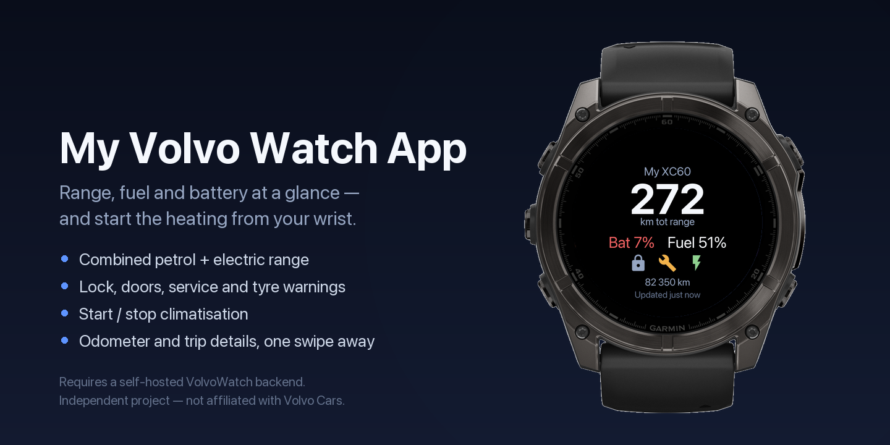
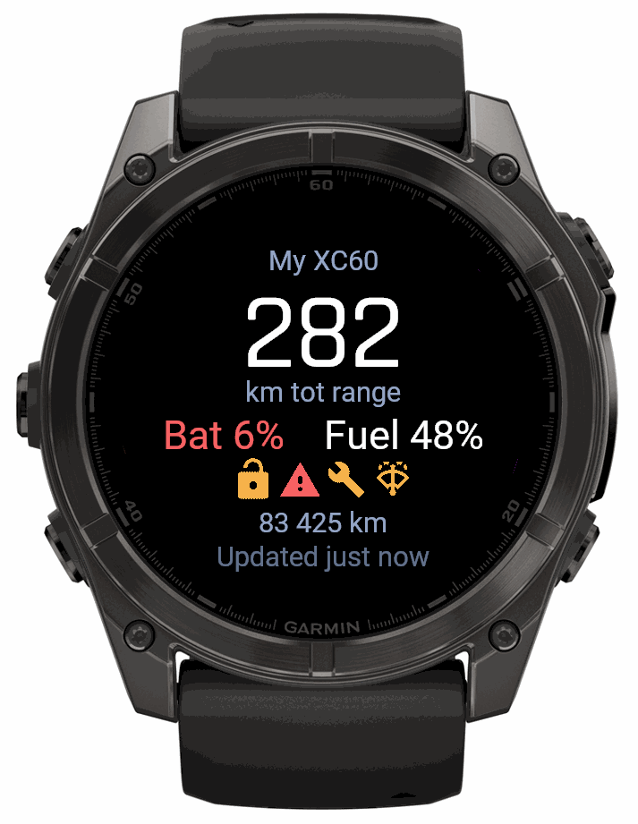
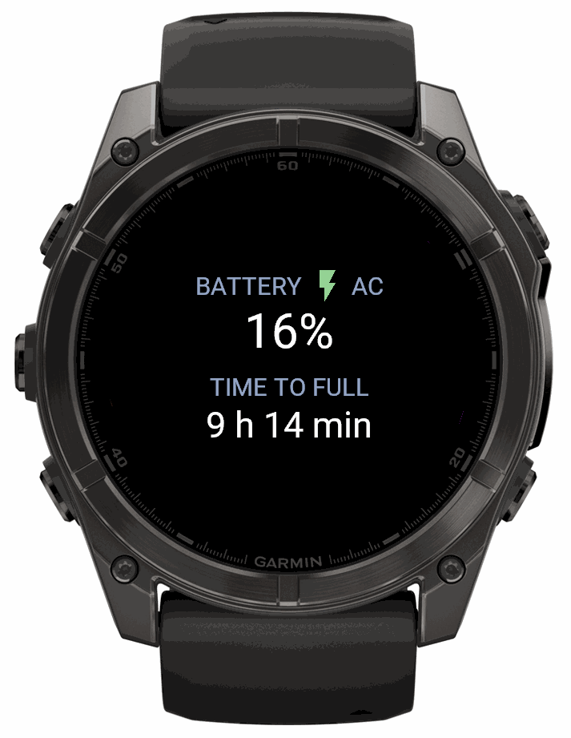
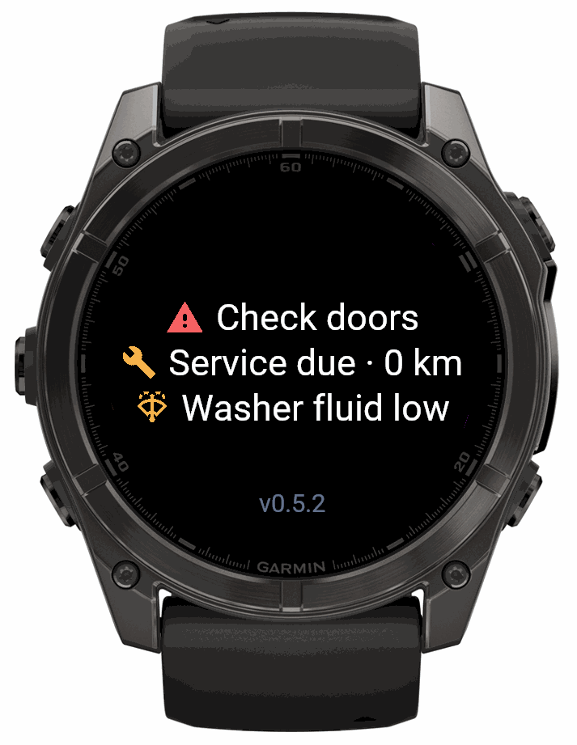

# VolvoWatch

A Garmin Connect IQ watch app that shows your Volvo's live status — range,
battery, fuel, lock state, charging, trip data and active warnings — plus
climate control, without reaching for your phone.



Independent project, not affiliated with, endorsed by, or supported by Volvo
Cars. "Volvo" is a trademark of Volvo Trademark Holding AB. Built on the
public [Volvo Cars Developer API](https://developer.volvocars.com/).

## What it does

| Status | Charging | Warnings |
|---|---|---|
|  |  |  |

- **Status** — combined petrol + electric range, lock state, doors/windows,
  service reminder, live "updated Xm ago" freshness.
- **Charging** — battery %, AC/DC, time to full; the battery figure turns
  green the moment the car is actively charging.
- **Trip** — a large odometer, average fuel consumption, both trip meters.
- **Warnings** — doors/windows called out separately, service due, washer
  fluid, tyre pressure, or a plain "no active warnings."
- **Climate control** — start climatisation from the watch, with a
  confirmation step, reporting what the car actually answered. (Stop is
  temporarily hidden — see the changelog.)
- **Glance card** — battery, fuel, range at a glance from the widget carousel.

Currently uses Volvo's default-scope ("Level 1") API — vehicle status and
climate control. Restricted-scope actions (remote lock/unlock, flash the
lights, honk) need a separate Volvo approval and aren't implemented yet.

Built and tested against a **plug-in hybrid (PHEV)** first. Everything above
already works for any Volvo with connected services; pure-EV-specific detail
is planned, not yet built.

## How it works

Volvo issues confidential OAuth credentials that can't safely live inside a
watch app, so VolvoWatch talks to a small backend (`backend/`, FastAPI) that
holds the Volvo tokens and exposes a tiny REST API to the watch. The app
comes configured to use a hosted instance of that backend, so most users
never need to run anything themselves — see **Pairing** below. The backend is
open source here if you'd rather run your own.

```
watch↔phone (Bluetooth/WiFi) → backend (HTTPS) → Volvo Cars API
```

## Pairing (for users)

1. Install the app from the Connect IQ Store.
2. On the watch, open the action menu (press select) → **Open connect
   page** — this sends a notification to your phone. Or just open the
   backend's `/link` page directly in any browser.
3. Sign in with your Volvo ID. You sign in on Volvo's own page — this app
   and its backend never see your password.
4. You'll get a short pairing code. Enter it in Garmin Connect Mobile's app
   settings, or directly on the watch with the on-screen code wheels.

No LTE on these devices — the watch needs your phone nearby or WiFi to reach
the backend.

## Repo layout

- **`backend/`** — FastAPI proxy: OAuth code+PKCE flow, encrypted token
  storage, watch-facing `/v1/status` + `/v1/command/{name}`. See
  `backend/README.md` and `backend/DEPLOY.md`.
- **`watch/`** — the Connect IQ widget itself (Monkey C). See
  `watch/README.md` for building/sideloading, `watch/CHANGELOG.md` for
  version history.
- **`docs/`** — `CONNECTING-A-CAR.md`, `SIDELOAD-FOR-A-FRIEND.md`.

## Running your own backend

Not required for normal use, but the whole point of self-hosting the token
store is that you can:

```bash
cd backend
cp .env.example .env          # fill in your own Volvo Developer credentials
python -m venv .venv && source .venv/bin/activate
pip install -e '.[dev]'
python -m app.cli gen-keys    # prints a FERNET_KEY + DEVICE_TOKEN_PEPPER for .env
uvicorn app.main:app --reload --port 8000
```

Then open `http://localhost:8000/link`, and point the watch app's Backend
URL setting at your own deployment. Full deploy notes in `backend/DEPLOY.md`.

## Status

v1.0.0, first public release. Feedback and issues welcome on this repository.

## License

[PolyForm Noncommercial 1.0.0](LICENSE) — free to use, modify, and
redistribute for any noncommercial purpose. Not licensed for commercial use,
including running a paid or ad-supported service based on this code.
